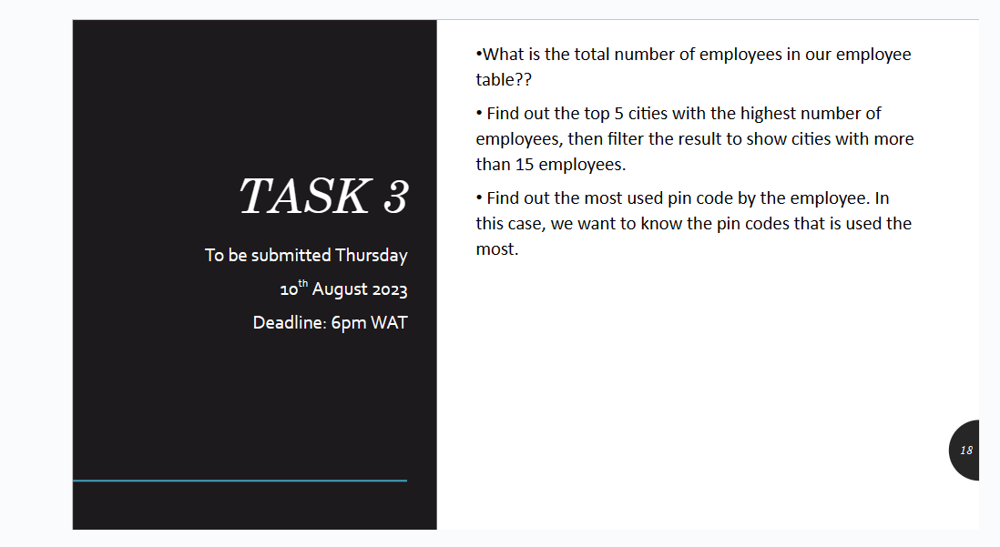
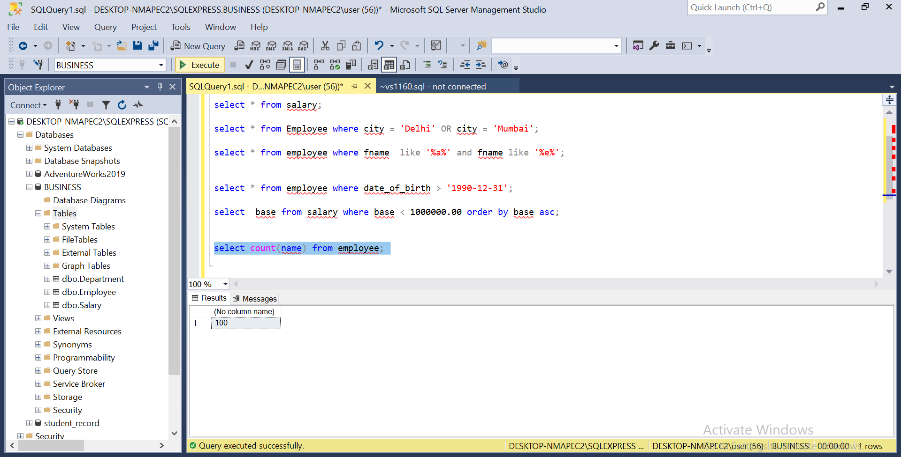
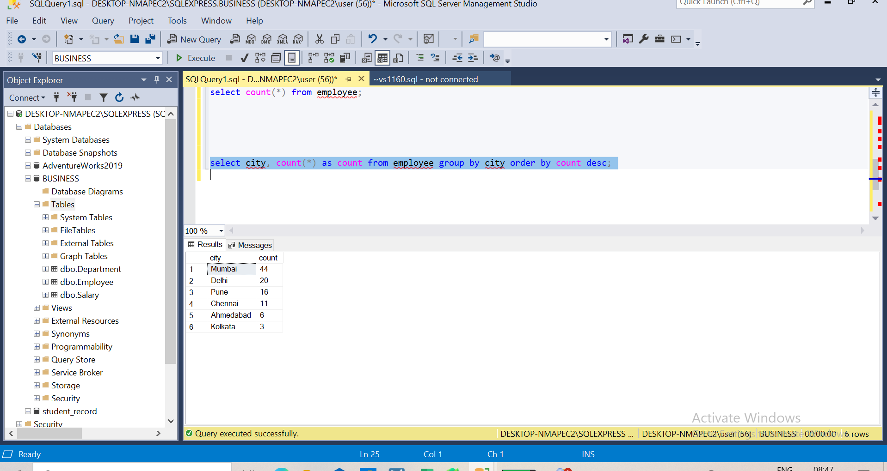
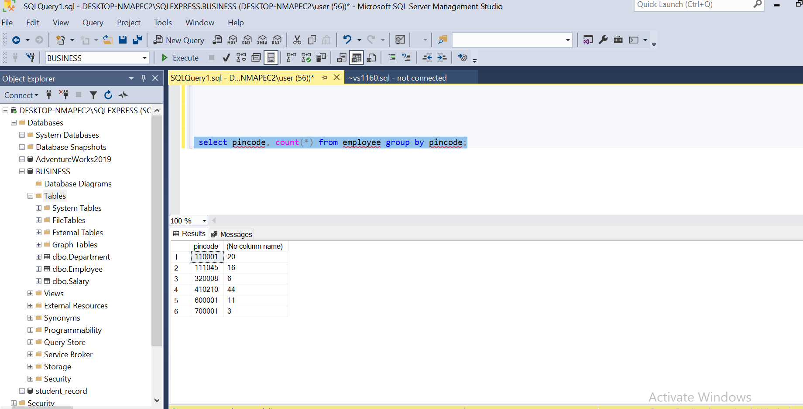
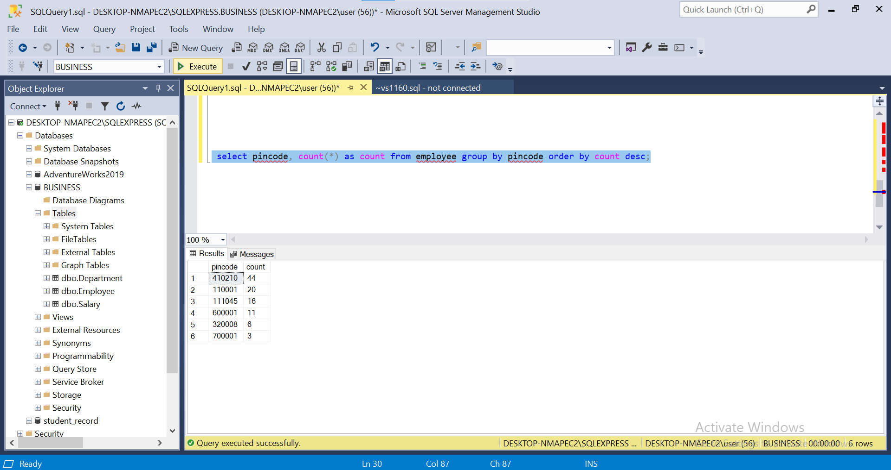

# SQL-TASK3
  I was given another task to solve using the Employee table i used in the task one of my previous repository.
  

  ---
  
   The first question i was asked to find the total number of employees in the employee table, using the aggregate function (count) (select count(*) from employee;)

   
   so it returned 100 s the total number of employees.

   ---

   The second question was a bit complex because its a two in one question, but i was able to solve it using a single syntax (select city, count(*) as count from employee group by city order by count desc;)
   
    i created a virtual column and used the ORDER BY clause to sort the numbers from the highest to the lowest, so from the image it shows the five top cities, and it also shows that only three cities produced above fifteen employees, Mumbai(44), Delhi(20), and Pune(16).

---

  The third and final question, i was asked to the pincode that was most used by the employees.
   using this syntax (select pincode, count(*) from employee group by pincode;) i was able to get the total number of times the different pincode was used.

   

   then i renamed the virtual column and sorted as well with the ORDER BY clause so we can see the numbers the different pincodes was used with this syntax (select pincode, count(*) as count from employee group by pincode order by count desc;)

   
   
 410210 was pincode used the most, and it was used 44 times.

 i hope the stated processes and syntaxes i used in answering the question is straight forward and understanding.
   
